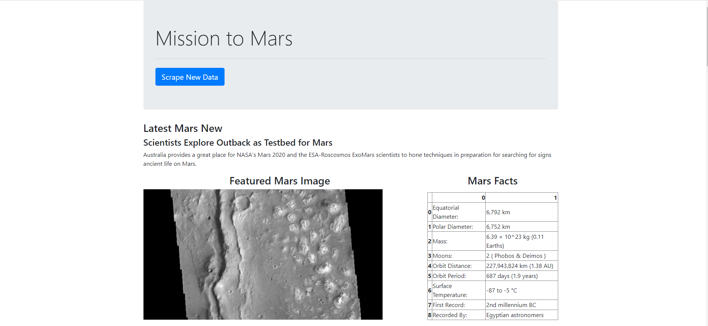
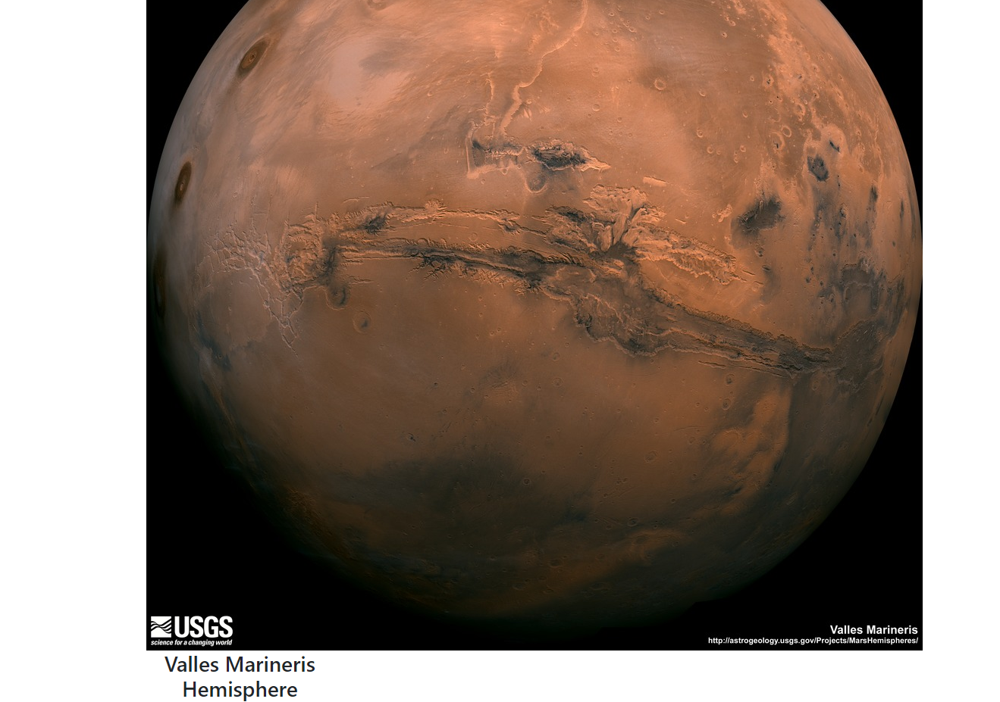
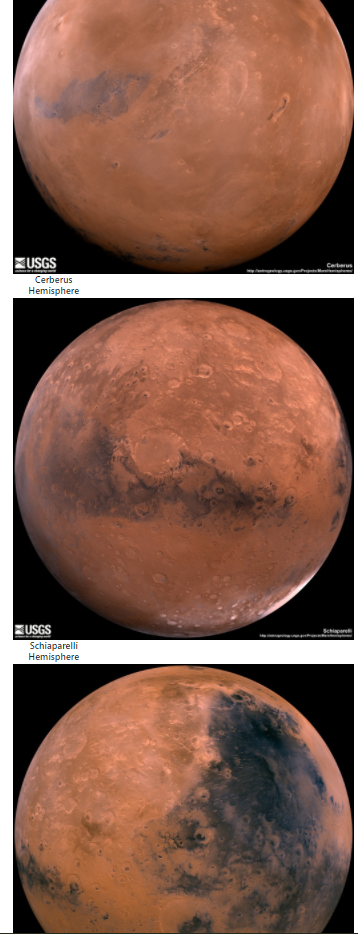

# web-scraping-challenge

Web scraping tools were used to pull picutures and information about the planet Mars from numerous sites. This was pulled using jupyter notebook and python formats.  Data was then loaded and rendered on an HTML page via Flask app.

